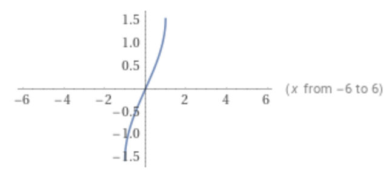
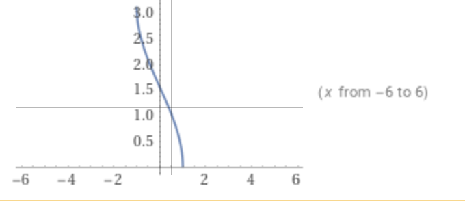
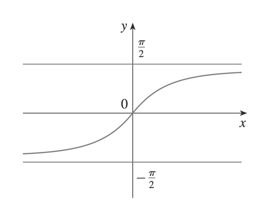

<head>
  
  
</head>

# Name of Basic Terms

Name|meaning
---|---
rational|有理的
integer|整数
sets|集合
domain|定义域
range|范围
independent variable|自变量
dependent variable|因变量
interval|区间
closed interval|闭区间
piecewise|分段的
slope|斜率
intercept|截距
slope-intercept|斜截距
polynomial|多项式
degree|次数
square root|二次方
cube root|三次方
six decimal places|小数点后六位
left-hand limit of function|左极限
approach|接近
arbitrary large|无穷大
the limit of f(x), as x approaches a, is infinity|好句子
the squeeze theorem|夹逼定理
(dis)continuity|连续性
(dis)continuous|连续的
hyperbola|双曲线
asymptotes|渐近线

# Name of Function

Name|meaning
---|---
even function|偶函数
odd function|奇函数
step function|阶跃函数
linear function|线性函数
quadratic function|二次函数
cubic function|三次函数
root function|根函数
reciprocal function|倒数函数
algebraic function|代数函数
trigonometric function|三角函数
exponential function|指数函数
logarithmic function|对数函数
inverse function|反函数

# Formulas and Qualities

## Formulas for Logarithms and 

$$\begin{cases}
  \log _a(xy)=\log _ax+\log _ay\\
  \log _a\frac{x}{y}=\log _ax-\log _ay\\
  \log _ax=\frac{\ln x}{\ln a}
\end{cases}$$

## inverse function

> The graph of inverse function is obtained by reflecting the graph of $f$ .

- Graph of $\arcsin x$

- Graph of $\arccos x$

- Graph of $\arctan x$

 