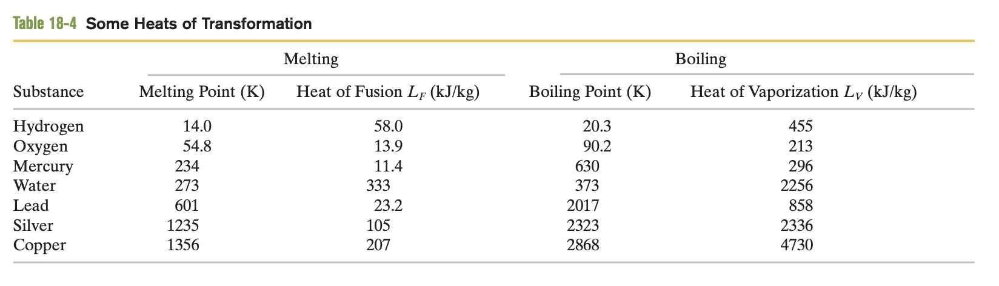

<head>
  
  
</head>

- [Waves](#waves)
- [Thermodynamics](#thermodynamics)
  - [The zeroth law of thermodynamics](#the-zeroth-law-of-thermodynamics)
  - [Measuring temperature](#measuring-temperature)
  - [Thermal expension](#thermal-expension)
  - [Aborption of heat](#aborption-of-heat)
  - [The First Law OF Thermodynamics](#the-first-law-of-thermodynamics)
  - [Heat Transfer Mechanisms](#heat-transfer-mechanisms)

# Waves

Name|Meaning
---|---
transverse waves|横波
longitudinal waves|纵波
particle|粒子
oscillate|震动
perpendicular to|垂直于
sinusoidal|正弦曲线
magnitude|大小
displacement|位移
matter waves|物质波
equilibrium|平衡
curve|曲线
derivative of|导数
velocity|速度
acceleration|加速度
elasticity|弹性
stationary|静止的

 Chapter 1

 Key Ideas

 1. Types of waves

    Name of waves|Features
    ---|---
    Transverse waves|Waves in which particles of medium oscillate perpendicular to the wave's direction of travel.
    Longitudinal waves| Waves in which particles of medium oscillate parallel to the wave's direction of travel

 2. Sinusoidal wave
   
    Format:

    $$ y(x,t)=y_m sin(kx-\omega t ) $$

    Where $y_m$ is the **amplitude** , $k$ is the **angular wave number** , $\omega$ is the **angular frequency** , $kx-\omega t$ is the **phase**

 3. Formula

    $$\begin{cases}
        &k=\frac{2\pi}{\lambda}\\
        &T=\frac{2\pi}{\omega}=\frac{1}{f}\\
        &v(speed)=\frac{\omega}{k}=\frac{\lambda}{T}=\lambda f
    \end{cases}$$

 4. Wave expression
   
   Any waves can be represented by a formula like 

   $$y(x,t)=h\sin(kx\pm \omega t)$$

   plus sign denotes a wave travelling to the negative direction and minus sign a wave travelling to the positive direction.

- Waves are of three main types: Mechanical waves;Electromagnetic waves;Matter waves.
- Phase constant $\phi,y_m\sin(kx \pm \omega t \pm \phi)$: Positive of phase constant shifts the curve to the negative direction; Negative phase constant shifts the curve to the positive direction.
- A travelling wave must be represented as $y(x,t)=h(kx\pm \omega t)$
- Transverse velocity $u$ equals to
  
  $$u=\frac{\partial y}{\partial t}$$

 Chapter 2:Wave speed on a stretched string(467)

- Physical quantities
  
  Name|Formula
  ---|---
  linear density|$\mu =\frac{m}{l}$
  wave speed on strings|$v=\sqrt{\frac{\tau}{\mu}},\tau$ the tension of string

# Thermodynamics

Name|Meaning
---|---
calibrate|校准
coexiste|并存
molar specific heat|摩尔比热容
mass|质量
the heat capacity|热容
work|功
denominator|分母
numerator|分子
expand|膨胀
contract|收缩
piston|活塞
insulating|绝缘的
reservoir|储存器
pressure varies with volume|气压随着体积改变
the principle of energy conservation|能量守恒定律
kinetic energy|动能
potential energy|势能
adiabatic|绝热
cyclical|循环的
internal energy|内能
conduction|传导
conduction rate|传导率
thermal conductivity|热传导性
convection|对流
emisivity|发射率

## The zeroth law of thermodynamics
 
  When two bodies are in thermal equilibrium, their temperatures are equal.

## Measuring temperature
 
 (1) $273.15$ kelvins $=0 ^\circ  C$
 
 (2) Celsius temperature scale 
  
  $$T_c=T-273.15k$$

 (3) Farenheit temperature scale 
  
  $$T_F=\frac{9}{5}T_c+32 ^\circ C$$

## Thermal expension
  
  (1) Linear expension:
  
  $$\Delta L=L \times \alpha \times \Delta T$$
   
  $, \alpha$ is a given constant value
  
  (2) Volume expension: 
   
  $$\Delta V=V \times \beta \times \Delta T$$
   
  ,$\beta =3\alpha \leftarrow$ just in solid.
   
   
  Heat is an energy that transferred between system and environment because a temperature difference between them.Heat is a transferred energy and it is not intrinsic property.

## Aborption of heat

 The Definition of Heat:
  
  Heat is an energy that transferred between system and environment because a temperature difference between them.Heat is a transferred energy and it is not intrinsic property.

  
  (1) $1$ Calories(Cal)=$4.1868$ Jouls(J)

  (2) Heat Capacity 热容
  
   Heat capacity $C$ is a proportionality constant between the heat absorbed $Q$ and temperature changed $\Delta T:$

  $$Q=C\Delta T$$ 

  (3) Specific heat 比热容

   Specific heat is a heat capacity per unit mass:

  $$Q=cm\Delta T$$

  (4) Molar specific heat 摩尔比热容

   $1$mol=$6.02\times 10^{23}$ elementary units

  (5) Heat of Transformation

   Heat of transformation $L$ is related to the heat that a sample needs to completely undergoes the phase of change.

   $$Q=Lm$$
  
   $L_F$ means the heat needed to transform the sample from solid to liquid or vice versa; $L_V$ means the heat needed to transform the sample from liquid to gas or vice versa.

   

## The First Law OF Thermodynamics

**The work done by the gas**

$$dW=\vec{F}\cdot d\vec{l}=(pA)(dl)=pdV \rightarrow W=\int dw=\int ^{v_2}_{v_1}pdV$$

**Internal Energy(First law)**

$$\Delta E_{int}=Q-W$$

## Heat Transfer Mechanisms

**Conduction**

Conduction rate:

$$P_{cond}=\frac{Q}{t}=kA\frac{T_H-T_C}{h}=A\frac{T_H-T_C}{R}$$

in which $k$ is a constant depend on the material of the slab, called *thermal conductivity*, $A$ is the face area of slab, $h$ is the thickness of the slab.

Figure

   

Thermal conductivities

**Thermal Resistance to Conduction(R-value)**

$$T=\frac{h}{k}$$

**Conduction Through a Composite Slab**

Figure

> Given that the rates of energy transfer of the two slab are equal 

$$P_{cond}=\frac{A(T_H-T_C)}{\sum  \frac{L}{k}}=\frac{A(T_H-T_C)}{\sum R}$$

**Convection**

Such energy transfer occurs when a fluid, such as air or water, comes in contact with an object whose tem- perature is higher than that of the fluid. The temperature of the part of the fluid that is in contact with the hot object increases, and (in most cases) that fluid expands and thus becomes less dense. Because this expanded fluid is now lighter than the surrounding cooler fluid, buoyant forces cause it to rise. Some of the surrounding cooler fluid then flows so as to take the place of the rising warmer fluid, and the process can then continue.

**Radiation**

Thermal radiation is a kind of electromagnetic signals. The rate of radiation:

$$P_{rad}=\sigma \epsilon A T^4$$

> $\sigma =5.6704 \times 10^{-8}$ is called Stefan-Boltzman constant , $\epsilon$ represents the emissivity. Which has a value between 0 and 1 , $T$ must be kelvins, $A$ is the surface area.

> If the emisivity of a surface up to 1, it is called *blackbody radiator* (will absorb all the energy that it intercept without reflection)

The rate of absorbtion at which the object absorb energy via thermal radiation is ($T$ also in kelvins):

$$P_{abs} =\sigma \epsilon A T^4_{environment}$$

The net rate of energy exchange is:

$$P_{net}=P_{abs}-P_{rad}$$

